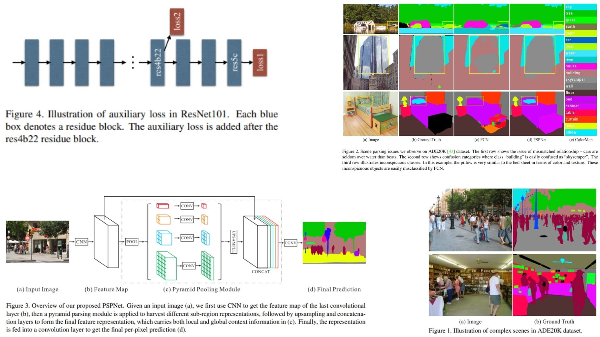

# 🧠 PSPNet-Replication — Pyramid Scene Parsing Network for Semantic Segmentation

This repository provides a **faithful Python replication of PSPNet (Pyramid Scene Parsing Network)** for 2D semantic segmentation.  
It implements the full pipeline described in the original paper, including a **dilated ResNet backbone** and a **Pyramid Pooling Module (PPM)** for capturing global context at multiple spatial scales.

Paper reference: *[Pyramid Scene Parsing Network (CVPR 2017)](https://arxiv.org/abs/1612.01105)*  

---

## Overview ✨



> PSPNet introduces a **pyramid pooling strategy** that aggregates contextual information from different regions of the feature map. This allows the network to understand both **local details and global scene structure simultaneously**.

Key components:

- **Backbone (Dilated ResNet)** extracts hierarchical feature maps $$F$$ with preserved spatial resolution  
- **Dilated Convolutions** replace downsampling to maintain output stride $$OS = 8 / 16$$  
- **Pyramid Pooling Module (PPM)** aggregates context at multiple scales $$\{1\times1, 2\times2, 3\times3, 6\times6\}$$  
- **Context features fusion** combines pooled representations $$C_i$$ into global descriptor $$C$$  
- **Segmentation head** maps fused features to pixel-wise logits $$\hat{Y}$$  
- **Final prediction** is upsampled to input resolution  

---

## Core Math 📐

**Backbone feature extraction:**

$$
F = \text{ResNet}_{dilated}(X)
$$

**Pyramid Pooling Module:**

For each scale $$s \in \{1,2,3,6\}$$:

$$
P_s = \text{Upsample}(\text{Pool}_s(F))
$$

Concatenated context representation:

$$
C = \text{Concat}(P_1, P_2, P_3, P_6, F)
$$

**Final feature refinement:**

$$
Z = \text{Conv}_{3\times3}(\text{BN}(\text{ReLU}(C)))
$$


**Segmentation output:**

$$
\hat{Y} = \text{Conv}_{1\times1}(Z)
$$


**Loss function (pixel-wise cross entropy):**

$$
\mathcal{L} = - \sum_{i} Y_i \log(\hat{Y}_i)
$$

---

## Why PSPNet Matters 🌌

- Captures **global context information** via pyramid pooling 🧩  
- Maintains spatial precision using **dilated convolutions** 🧠  
- Strong performance on **scene parsing and complex segmentation tasks** 🖼️  
- Balances **local detail + global structure understanding** 🌍  

---

## Repository Structure 🏗️

```bash
PSPNet-Replication/
├── src/
│   ├── blocks/
│   │   ├── conv_block.py        # Conv + BN + ReLU
│   │   ├── dilated_conv.py      # Atrous conv (ResNet backbone)
│   │   ├── pyramid_pooling.py   # PPM (1x1, 2x2, 3x3, 6x6)
│   │   └── upsample.py          # Bilinear upsampling
│   │
│   ├── backbone/
│   │   └── resnet_dilated.py    # Modified ResNet (output_stride 8/16)
│   │
│   ├── encoder/
│   │   └── encoder.py           # Feature extraction pipeline (Fig. 3 style)
│   │
│   ├── head/
│   │   └── segmentation_head.py # 1x1 conv classifier (pixel-wise logits)
│   │
│   ├── model/
│   │   └── pspnet.py            # Full PSPNet architecture
│   │
│   └── config.py                # training-free inference config (OS, scales)
│
├── images/
│   └── figmix.jpg
│
├── requirements.txt
└── README.md
```

---

## 🔗 Feedback

For questions or feedback, contact:  
[barkin.adiguzel@gmail.com](mailto:barkin.adiguzel@gmail.com)
